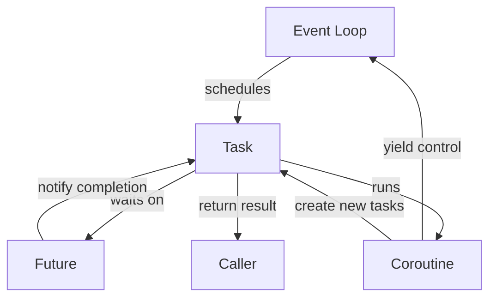

# Asyncio Event Loop

```mermaid
graph TD;
    A[Event Loop] -->|schedules| B[Task];
    B -->|waits on| C[Future];
    B -->|runs| D[Coroutine];
    D -->|yield control| A;
    D -->|create new tasks| B;
    C -->|notify completion| B;
    B -->|return result| E[Caller];

```
