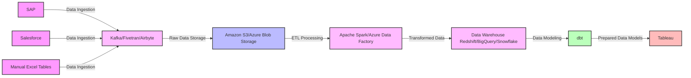

# Data Processing Architecture - Data Model

The diagram below illustrates the data processing architecture for the data model. The data model is built using various data processing and transformation tools and the prepared data models are used in Tableau for visualization.

