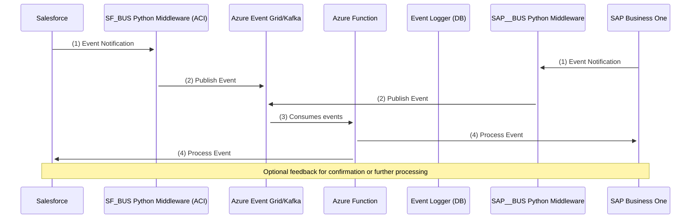

```mermaid
sequenceDiagram
    participant Salesforce
    participant SF_Middleware as SF_BUS Python Middleware (ACI)
    participant AEG as Azure Event Grid/Kafka
    participant AFunc as Azure Function
    participant Logger as Event Logger (DB)
    participant SAP_Middleware as SAP__BUS Python Middleware
    participant SAP_B1 as SAP Business One

    Salesforce->>+SF_Middleware: (1) Event Notification
    SAP_B1->>+SAP_Middleware: (1) Event Notification
    SF_Middleware->>+AEG: (2) Publish Event
    SAP_Middleware->>+AEG: (2) Publish Event
    AEG->>+AFunc: (3) Consumes events
    AFunc->>+SAP_B1: (4) Process Event
    AFunc->>+Salesforce: (4) Process Event

    Note over Salesforce,SAP_B1: Optional feedback for confirmation or further processing
```