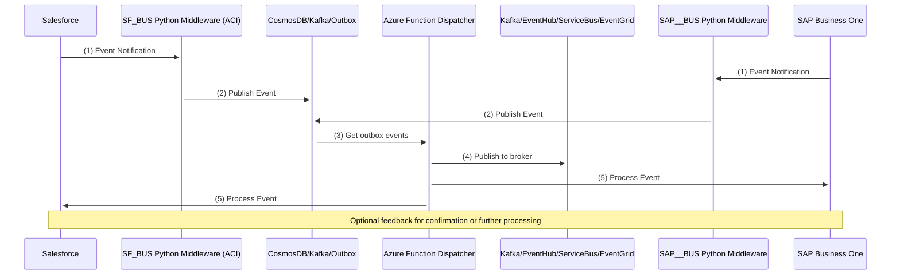
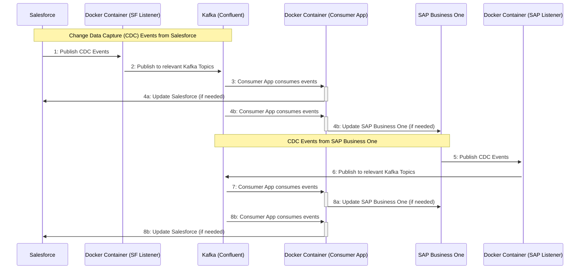
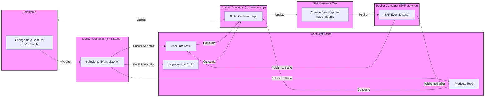

# Integration Architecture V1

## Integration Architecture Sequence Diagram

The following sequence diagram illustrates the flow of data between Salesforce and SAP Business One using Kafka as the message broker. The diagram also shows the change data capture (CDC) mechanism in Salesforce and SAP Business One, and the consumer application that processes the events from Kafka and updates the respective system.

# Integration Architecture V2

## Integration Architecture Sequence Diagram V2

The following sequence diagram illustrates the flow of data between Salesforce and SAP Business One using Kafka as the message broker. The diagram also shows the change data capture (CDC) mechanism in Salesforce and SAP Business One, and the consumer application that processes the events from Kafka and updates the respective system.

## Integration Architecture Flow Diagram

The following diagram illustrates the flow of data between Salesforce and SAP Business One using Kafka as the message broker. The diagram also shows the change data capture (CDC) mechanism in Salesforce and SAP Business One, and the consumer application that processes the events from Kafka and updates the respective system.

